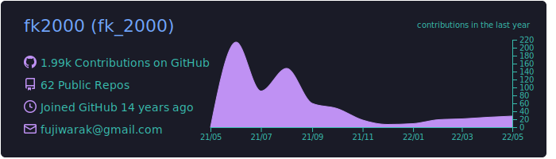
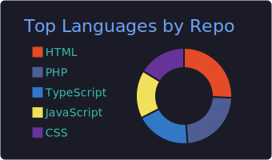
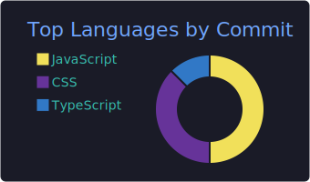
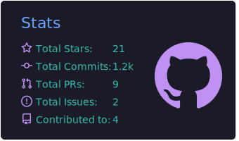
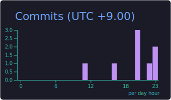

<div align="center">
  
  <h1>fk2000's CLI Tool</h1>
  <p>
    <strong>The personal command-line interface for <a href="https://fk2000.github.io">fk2000</a></strong>
  </p>

  <p>
    <a href="https://www.npmjs.com/package/fk2000"></a>
    <a href="https://github.com/fk2000/fk2000/blob/master/license"></a>
  </p>
</div>

---

## 📊 GitHub Contributions & Stats

<p align="center">
  
  
</p>

### 🛠️ GitHub Profile Summary Cards

<p align="center">
  
</p>

<div align="center">
  
  
</div>

<div align="center">
  
  
</div>

---

Welcome! This is my digital business card that lives right in your terminal. I'm a consulting and infrastructure engineer who loves Ruby on Rails and building cool stuff.

## 🚀 Quick Start

No installation required! Just run this command with Node.js:

```bash
npx fk2000
```

## 📸 Preview

<p align="center">
  
</p>

## 🛠️ Built With

*   [Ink](https://github.com/vadimdemedes/ink) - React for interactive command-line apps
*   [terminal-image](https://github.com/sindresorhus/terminal-image) - Display images in the terminal
*   [meow](https://github.com/sindresorhus/meow) - CLI app helper

## 💖 Support

If you like what I do, consider supporting me:

*   [](https://www.paypal.me/KentaFujiwara) - Buy me a tea! 🍵

---

<div align="center">
  MIT © <a href="https://fk2000.github.io">fk2000</a>
</div>
