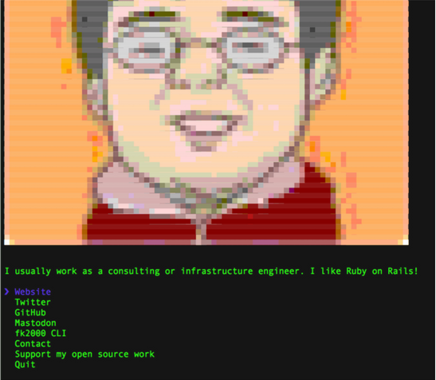

# fk2000

## Hi there!
[](https://github.com/vn7n24fzkq/github-profile-summary-cards)
[](https://github.com/vn7n24fzkq/github-profile-summary-cards) [](https://github.com/vn7n24fzkq/github-profile-summary-cards)
[](https://github.com/vn7n24fzkq/github-profile-summary-cards) [](https://github.com/vn7n24fzkq/github-profile-summary-cards)

## status


## CLI

> The [fk2000](https://fk2000.github.io) CLI




## Usage

Install Node.js, then:

```
$ npx fk2000
```


## Built with

- [ink](https://github.com/vadimdemedes/ink) - React for interactive command-line apps
- [terminal-image](https://github.com/fk2000/terminal-image) - Display images in the terminal


## License

MIT © [fk2000](https://fk2000.github.io)

## Special Thanks

- [](https://www.paypal.me/KentaFujiwara) - You can make one-time donations via PayPal. I'll probably buy a ~~coffee~~ tea. :tea:

Thanks! :heart:

